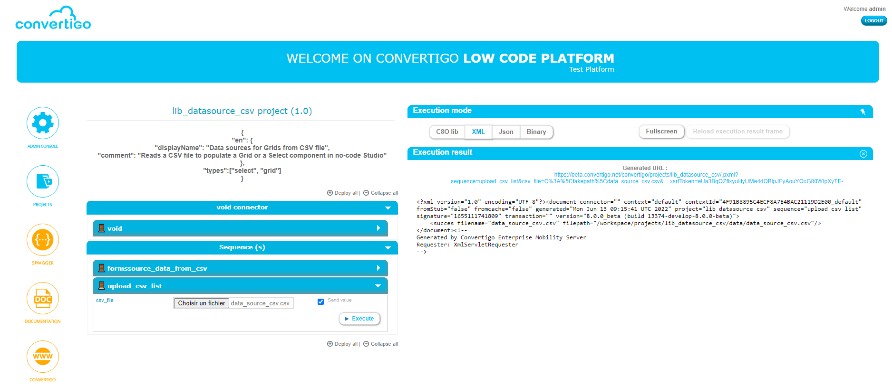
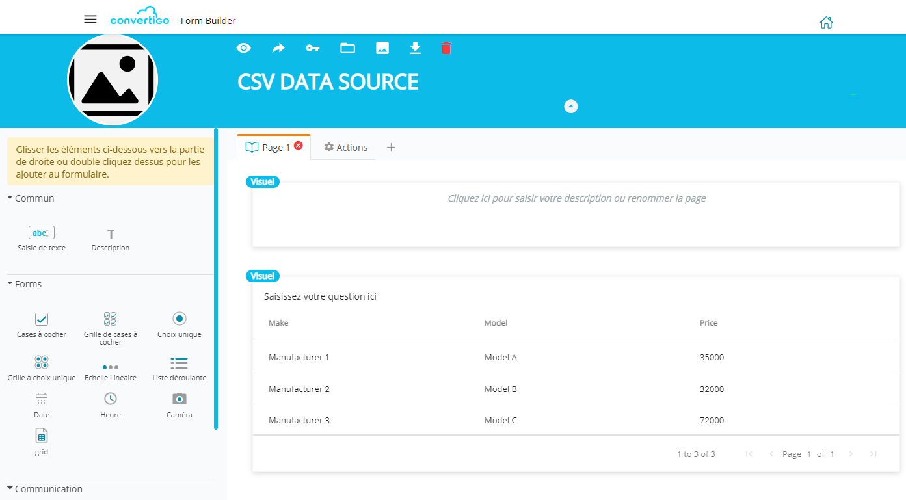
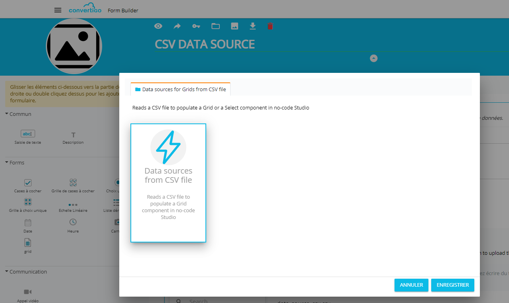
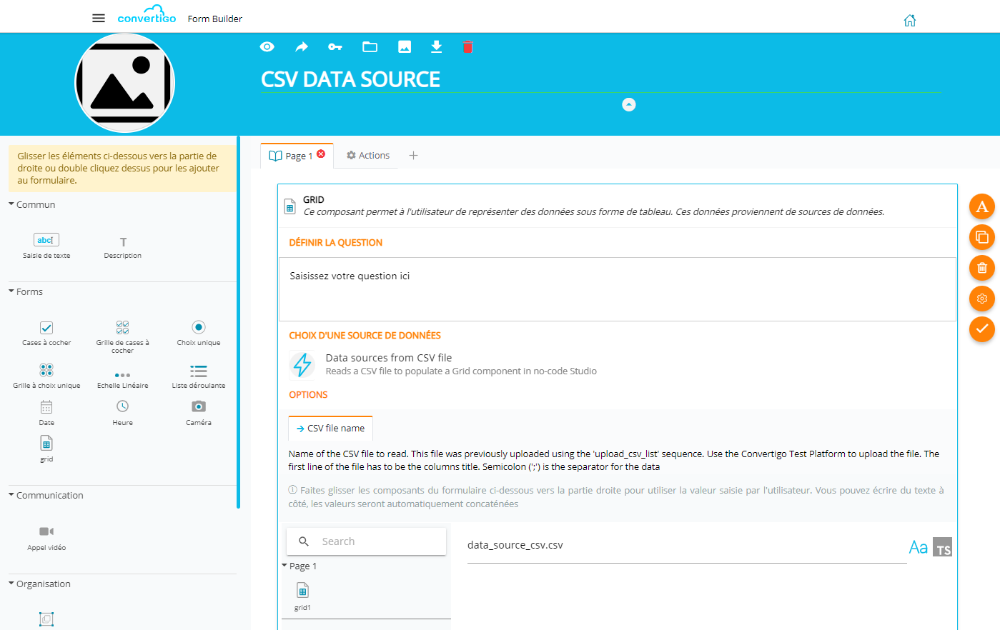

# lib_datasource_csv

This lib generates data sources for Grids components in the Convertigo No-Code Studio from a CSV file.

## Usage

### upload_csv_list sequence

First thing first, the CSV file has to be uploaded to the No-Code server using the **upload_csv_list** sequence.\
The first line of the CSV file must contain the columns title.\
Data are separated by semicolons [';']\
For example:

```
colonne 1;colonne 2;colonne 3;colonne 4
value 01;value 02;value 03;value04
value 11;value 12;value 13;value14
value 21;value 22;value 23;value24
value 31;value 32;value 33;value34
value 41;value 42;value 43;value44
```

Use the **Convertigo Test Platform** to execute the sequence and upload your CSV file.



### Grid data source

In the No-Code Studio, import the "**Data sources from CSV file**" in your Grid component.




Fill the "**CSV file name**" variable with the name of the uploaded CSV file (see first step).



#### Variables

| Name                    | Description                                           |
|-------------------------|-------------------------------------------------------|
| **forms_csv_file_name** | CSV File Name                                         |
| **forms_rowvalue_col**  | Column name for the returned value of the clicked row. Grid only. |
| **forms_filter_column** | Column name to filter on. Grid only.                              |
| **forms_filter_value**  | Value text to filter on. Grid only.                               |
| **forms_data_type**     | Type of the target component. Can be 'grid' or 'select'. Default is 'grid'.                              |
| **forms_filter**        | *** DO NOT FILL ***. Used by the Select component itself.                               |
